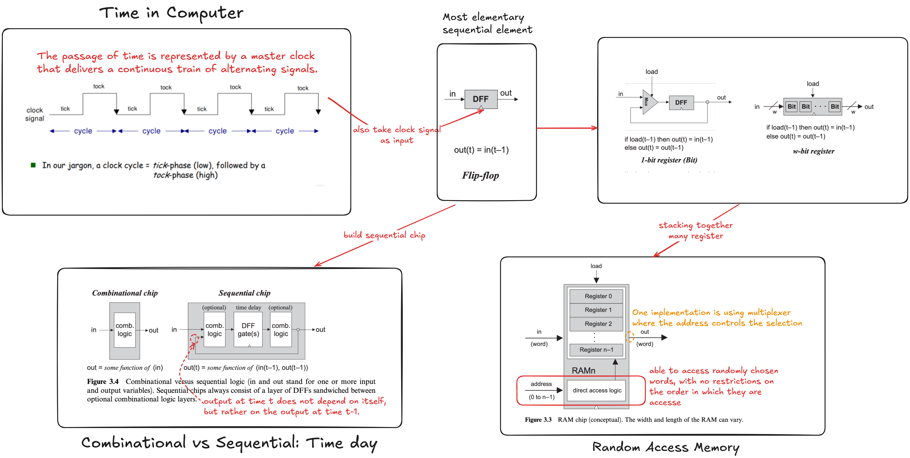

# Goal 

Build memory elements that can preserve data over time for computer to store and recall values.

# The act of ‘‘remembering something’’ is inherently **time-dependent**

You remember *now* what has been committed to memory *before*. Thus, in order to build chips that ‘‘remember’’ information, we must first develop some standard means for representing the progression of time.

